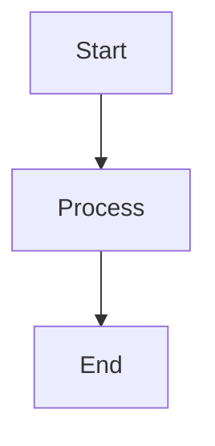
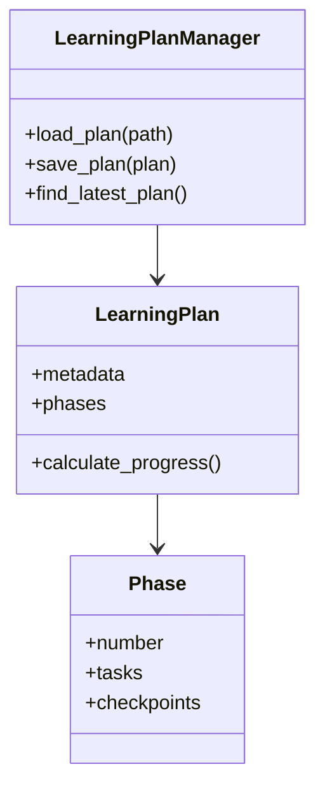
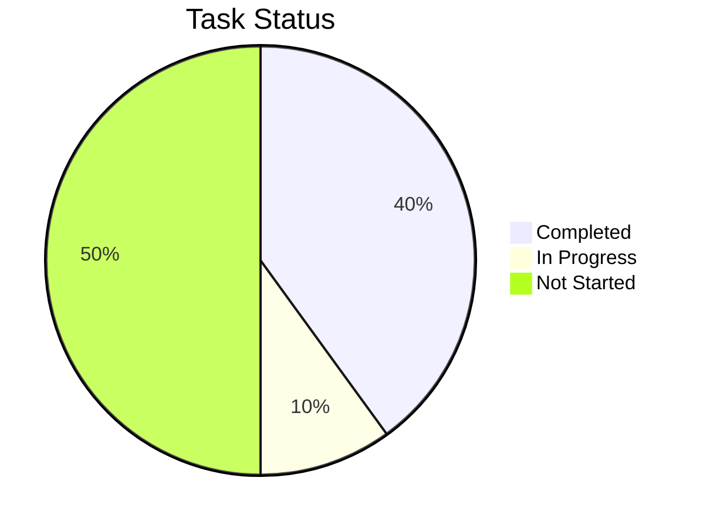
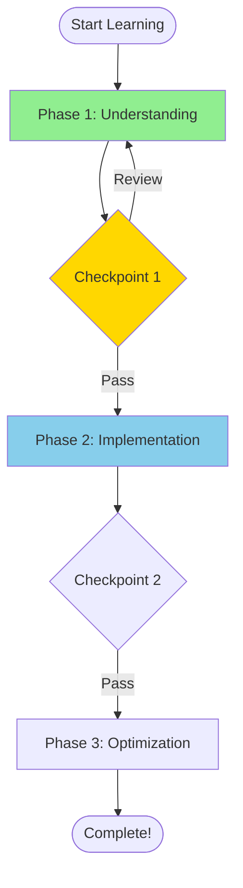

# Phase 3: interactive-diagram Skill - Implementation Plan

**Created**: 2025-10-19
**Status**: Ready to Implement
**Target Completion**: 4-5 hours
**Priority**: High

---

## Executive Summary

Phase 3 implements the **interactive-diagram** skill, which generates visual learning aids to enhance comprehension. This skill creates Mermaid diagrams from code-analysis and learning-analytics data, transforming abstract concepts into visual representations.

**Key Innovation**: Text-based diagram generation (Mermaid) - no rendering libraries needed, works everywhere (GitHub, VS Code, Claude, etc.)

---

## What Will Be Delivered

### 1. interactive-diagram Skill (4-5 files, ~1,200 lines)

```
skills/interactive_diagram/
├── __init__.py          (~50 lines)    - Package exports
├── models.py            (~200 lines)   - Diagram models
├── generator.py         (~600 lines)   - Main generator class
├── mermaid_builder.py   (~250 lines)   - Mermaid syntax helpers
├── skill.md             (~400 lines)   - Agent integration guide
└── README.md            (~350 lines)   - User documentation
```

### 2. Diagram Types

**Code Structure** (3 types):
- Class diagrams from code-analysis
- Dependency graphs
- Call flow diagrams (simplified)

**Learning Progress** (3 types):
- Progress pie/bar charts
- Learning journey flowcharts
- Velocity trend visualizations

**Planning** (2 types):
- Gantt charts for timelines
- Milestone roadmaps

**Total**: 8 diagram types

### 3. Testing (~350 lines)

- 10 comprehensive tests
- Visual verification examples
- Integration tests with real data

### 4. Documentation

- Complete technical spec ✅ (already created)
- Implementation plan (this document)
- User README
- Agent integration guide

---

## Implementation Roadmap

### Task 1: Core Models & Infrastructure (45 min)

**File**: `skills/interactive_diagram/models.py`

**Implement**:
```python
# Enums
class DiagramType(str, Enum):
    CLASS_DIAGRAM = "class_diagram"
    DEPENDENCY_GRAPH = "dependency_graph"
    PROGRESS_CHART = "progress_chart"
    LEARNING_JOURNEY = "learning_journey"
    GANTT_CHART = "gantt_chart"
    # ... others

# Models
class DiagramStyle(BaseModel):
    theme: str
    show_labels: bool
    show_legend: bool
    color_scheme: Dict[str, str]
    orientation: str

class Diagram(BaseModel):
    diagram_type: DiagramType
    title: str
    description: Optional[str]
    mermaid_code: str
    style: DiagramStyle
    metadata: Dict[str, Any]

    def to_markdown(self) -> str
    def to_html(self) -> str

class DiagramCollection(BaseModel):
    title: str
    diagrams: List[Diagram]

    def to_markdown(self) -> str
```

---

### Task 2: Mermaid Builder Utilities (30 min)

**File**: `skills/interactive_diagram/mermaid_builder.py`

**Implement**:
```python
class MermaidBuilder:
    """Helper class for building Mermaid syntax"""

    def __init__(self, diagram_type: str):
        self.lines = []
        self.diagram_type = diagram_type

    def add_header(self, direction: str = "TD"):
        """Add diagram header"""

    def add_node(self, id: str, label: str, shape: str = "rect"):
        """Add a node"""

    def add_edge(self, from_id: str, to_id: str, label: str = ""):
        """Add an edge between nodes"""

    def add_style(self, node_id: str, fill: str, stroke: str = ""):
        """Add styling to node"""

    def add_subgraph(self, title: str, nodes: List[str]):
        """Add a subgraph"""

    def build(self) -> str:
        """Return complete Mermaid code"""
```

**Helper functions**:
```python
def sanitize_mermaid_label(text: str) -> str:
    """Escape special characters for Mermaid"""

def generate_node_id(name: str) -> str:
    """Generate safe node ID"""

def get_color_for_status(status: str) -> str:
    """Map status to color"""
```

---

### Task 3: Code Structure Diagrams (60 min)

**File**: `skills/interactive_diagram/generator.py` (part 1)

**Implement**:
```python
class DiagramGenerator:
    def generate_class_diagram(
        self,
        code_analysis: CodebaseAnalysis,
        focus_files: Optional[List[str]] = None,
        max_classes: int = 10
    ) -> Diagram:
        """
        Generate class diagram from code analysis.

        Algorithm:
        1. Extract classes from code_analysis
        2. For each class:
           - Create class node with methods
           - Find relationships (inheritance, composition)
        3. Limit to max_classes (most important)
        4. Build Mermaid classDiagram syntax
        5. Add styling based on patterns detected
        """

    def generate_dependency_graph(
        self,
        code_analysis: CodebaseAnalysis,
        max_files: int = 15
    ) -> Diagram:
        """
        Generate dependency graph from imports.

        Algorithm:
        1. Extract file dependencies from code_analysis
        2. Build graph structure
        3. Detect circular dependencies
        4. Create Mermaid graph with:
           - Nodes for files
           - Edges for imports
           - Highlight circular deps in red
        """

    def generate_call_flow(
        self,
        code_analysis: CodebaseAnalysis,
        entry_function: str,
        max_depth: int = 3
    ) -> Diagram:
        """
        Generate call flow diagram.

        Algorithm:
        1. Start from entry_function
        2. Recursively find called functions (up to max_depth)
        3. Build flowchart showing call chain
        4. Use different shapes for different function types
        """
```

---

### Task 4: Learning Progress Diagrams (45 min)

**File**: `skills/interactive_diagram/generator.py` (part 2)

**Implement**:
```python
    def generate_progress_chart(
        self,
        analytics: LearningAnalytics
    ) -> Diagram:
        """
        Generate progress pie chart.

        Algorithm:
        1. Get task counts from analytics
        2. Calculate percentages
        3. Build Mermaid pie chart
        4. Color code by status
        """

    def generate_learning_journey(
        self,
        plan: LearningPlan,
        analytics: Optional[LearningAnalytics] = None
    ) -> Diagram:
        """
        Generate learning journey flowchart.

        Algorithm:
        1. Extract phases and tasks from plan
        2. Create flowchart nodes:
           - Start node
           - Phase nodes
           - Checkpoint decision nodes
           - End node
        3. Connect with arrows
        4. Color completed items green, current blue, future gray
        5. Add struggle indicators if analytics provided
        """

    def generate_velocity_trend(
        self,
        analytics: LearningAnalytics,
        show_weeks: int = 4
    ) -> Diagram:
        """
        Generate velocity trend chart.

        Algorithm:
        1. Get velocity data from analytics
        2. Create timeline nodes for each week
        3. Connect with arrows
        4. Color code: green=increasing, yellow=stable, red=decreasing
        5. Show tasks/week on each node
        """
```

---

### Task 5: Planning Diagrams (30 min)

**File**: `skills/interactive_diagram/generator.py` (part 3)

**Implement**:
```python
    def generate_gantt_chart(
        self,
        plan: LearningPlan,
        analytics: Optional[LearningAnalytics] = None
    ) -> Diagram:
        """
        Generate Gantt chart for timeline.

        Algorithm:
        1. Extract phases and estimated times
        2. Calculate start/end dates
        3. Build Mermaid gantt syntax
        4. Mark completed items as :done
        5. Mark current item as :active
        """

    def generate_milestone_map(
        self,
        plan: LearningPlan
    ) -> Diagram:
        """
        Generate milestone roadmap.

        Algorithm:
        1. Extract checkpoints from plan
        2. Create timeline with milestones
        3. Show phase boundaries
        4. Highlight completed milestones
        """
```

---

### Task 6: Package Setup (10 min)

**File**: `skills/interactive_diagram/__init__.py`

```python
from .models import (
    DiagramType,
    DiagramStyle,
    Diagram,
    DiagramCollection,
)

from .generator import DiagramGenerator

__all__ = [
    "DiagramType",
    "DiagramStyle",
    "Diagram",
    "DiagramCollection",
    "DiagramGenerator",
]

__version__ = "1.0.0"
```

---

### Task 7: Agent Integration Guide (30 min)

**File**: `skills/interactive_diagram/skill.md`

**Contents**:
- Skill description and capabilities
- When agents should invoke it
- Output format (Mermaid code blocks)
- Usage examples for each diagram type
- Integration with code-architecture-mentor
- Integration with learning-coordinator
- Best practices

---

### Task 8: User Documentation (25 min)

**File**: `skills/interactive_diagram/README.md`

**Sections**:
1. Overview and features
2. Quick start
3. API reference
4. Diagram types guide
5. Styling options
6. Examples
7. Integration with other skills
8. Rendering Mermaid diagrams

---

### Task 9: Comprehensive Testing (45 min)

**File**: `examples/test_interactive_diagram.py`

**Tests**:
```python
def test_class_diagram_generation()
def test_dependency_graph_generation()
def test_progress_chart_generation()
def test_learning_journey_generation()
def test_gantt_chart_generation()
def test_mermaid_syntax_validity()
def test_markdown_export()
def test_html_export()
def test_diagram_collection()
def test_custom_styling()
```

**Visual tests**: Create example diagrams and save to files for manual verification.

---

### Task 10: Integration Demo (20 min)

**File**: `examples/skills_integration_demo.py`

Add Demo 7:
```python
def demo_interactive_diagrams():
    """
    Demo: Generate visual diagrams from skills data
    """
    # 1. Class diagram from code-analysis
    # 2. Progress chart from learning-analytics
    # 3. Learning journey from plan + analytics
    # 4. Show how agents use diagrams
```

---

## Timeline Estimate

| Task | Time | Status |
|------|------|--------|
| Core models | 45 min | ⏳ |
| Mermaid builder | 30 min | ⏳ |
| Code diagrams | 60 min | ⏳ |
| Progress diagrams | 45 min | ⏳ |
| Planning diagrams | 30 min | ⏳ |
| Package setup | 10 min | ⏳ |
| skill.md | 30 min | ⏳ |
| README.md | 25 min | ⏳ |
| Tests | 45 min | ⏳ |
| Integration demo | 20 min | ⏳ |
| **TOTAL** | **5 hours 20 min** | |

---

## Dependencies

### Required (from Phase 1 & 2)
- ✅ code-analysis skill (for class/dependency diagrams)
- ✅ learning-analytics skill (for progress/velocity diagrams)
- ✅ learning-plan-manager skill (for plan structure)

### Python Libraries
- ✅ Standard library only (typing, enum, dataclasses)
- ✅ Pydantic (already in use)

**No new dependencies!** ✅

---

## Success Criteria

Phase 3 complete when:

- [ ] DiagramType enum with 8+ types
- [ ] Diagram and DiagramCollection models
- [ ] MermaidBuilder utility class
- [ ] DiagramGenerator class with 8+ diagram methods
- [ ] skill.md created (agent integration guide)
- [ ] README.md created (user documentation)
- [ ] Tests created and passing (10/10)
- [ ] Integration demo added (Demo 7)
- [ ] Example diagrams verified visually
- [ ] All files committed to git

---

## Mermaid Rendering

### Where Mermaid Works

- ✅ GitHub (markdown files, PR descriptions, issues)
- ✅ GitLab (markdown files)
- ✅ VS Code (with Mermaid extension)
- ✅ Notion (via mermaid blocks)
- ✅ Claude (renders Mermaid in responses)
- ✅ Many markdown editors

### Example Rendering

**Input** (text):
```

```

**Output** (visual):


---

## Key Design Decisions

### 1. Why Mermaid?

**Pros**:
- ✅ Text-based (no rendering library needed)
- ✅ Widely supported (GitHub, VS Code, etc.)
- ✅ Version control friendly
- ✅ Lightweight
- ✅ Actively maintained
- ✅ Rich diagram types

**Cons**:
- ⚠️ Syntax can be finicky
- ⚠️ Limited customization vs full SVG
- ⚠️ Client-side rendering only

**Decision**: Pros outweigh cons for educational use case.

### 2. Diagram Type Selection

**Included**:
- Class diagrams (architecture teaching)
- Dependency graphs (understanding code)
- Progress charts (motivation)
- Learning journey (context)
- Gantt charts (timeline planning)

**Excluded** (for now):
- Sequence diagrams (complex, less useful for learning)
- ER diagrams (database-focused, narrow use case)
- State diagrams (too specialized)

Can add later if needed.

### 3. Simplification Strategy

**Complex diagrams** (50+ nodes) are hard to read.

**Solution**:
- Limit nodes (max_classes, max_files parameters)
- Focus on most important elements
- Use subgraphs to group
- Provide filtering options

---

## Risk Assessment

### Low Risk ✅
- Mermaid syntax well-documented
- Text generation (no rendering complexity)
- No new dependencies
- Clear use cases

### Mitigations
- **Syntax errors**: Validate Mermaid syntax in tests
- **Complex diagrams**: Add max_nodes limits
- **Performance**: Generate lazily, cache results

---

## Example Output

### Class Diagram Example

```markdown
## Learning Plan Manager Architecture


```

### Progress Chart Example

```markdown
## Your Learning Progress


```

### Learning Journey Example

```markdown
## Your Learning Journey


```

---

## Next Steps After Phase 3

### Phase 4 Options

**Option A: session-state** (Medium Priority)
- Cross-session student profiles
- Learning history tracking
- Personalized teaching memory

**Option B: notebook-learning** (Medium Priority)
- Jupyter notebook integration
- Interactive coding exercises
- Live execution and feedback

**Option C: multi-modal-learning** (Future)
- Image/video integration
- Audio explanations
- Multi-sensory learning

---

## Summary

Phase 3 delivers the **interactive-diagram** skill:

✅ **8 diagram types** for different use cases
✅ **Mermaid-based** - works everywhere
✅ **No dependencies** - pure text generation
✅ **Data integration** - uses Phase 1 & 2 skills
✅ **Visual learning** - improves comprehension and engagement

**Complexity**: Medium - structured text generation
**Value**: High - visual aids dramatically improve learning
**Estimated Time**: 4-5 hours

---

*Implementation Plan Ready - Let's Build!*
