# Phase 3: interactive-diagram Skill - Technical Specification

**Purpose**: Generate visual learning aids including architecture diagrams, progress charts, learning flowcharts, and dependency graphs to enhance visual learning.

**Created**: 2025-10-19
**Version**: 1.0
**Status**: Technical Specification

---

## Table of Contents

1. [Overview](#overview)
2. [Dependencies](#dependencies)
3. [Data Models](#data-models)
4. [Core Functionality](#core-functionality)
5. [Diagram Types](#diagram-types)
6. [Implementation Approach](#implementation-approach)
7. [Testing Strategy](#testing-strategy)
8. [Integration with Agents](#integration-with-agents)
9. [Performance Considerations](#performance-considerations)

---

## Overview

### Purpose

The interactive-diagram skill generates visual representations to enhance learning through:
- Architecture diagrams from code analysis
- Progress visualizations from learning analytics
- Learning journey flowcharts
- Dependency graphs
- Concept relationship maps

Visual learning aids improve comprehension, retention, and engagement.

### Use Cases

1. **Code Architecture Mentor**: Show architecture diagrams when teaching design patterns
2. **Learning Coordinator**: Visualize student progress and learning journey
3. **Debugging Detective**: Show code dependencies and call flows
4. **Plan Generation Mentor**: Visualize learning path and milestones
5. **Student Dashboard**: Visual progress tracking and achievements

### Key Features

- **Mermaid Diagram Generation**: Industry-standard, renderable diagrams
- **Multiple Diagram Types**: Flowcharts, class diagrams, gantt charts, pie charts
- **Data Integration**: Uses code-analysis and learning-analytics data
- **Markdown Compatible**: Diagrams render in markdown viewers
- **Interactive Elements**: Clickable nodes, tooltips, colors
- **Export Formats**: Mermaid, SVG, PNG (via external tools)

---

## Dependencies

### Required Skills

**code-analysis** (Phase 1) ✅
- Provides code structure, patterns, dependencies

**learning-analytics** (Phase 2) ✅
- Provides progress data, velocity, struggles

**learning-plan-manager** (Phase 1) ✅
- Provides plan structure, phases, tasks

### Python Libraries

```python
# Standard library only - no new dependencies!
from typing import List, Dict, Optional, Any
from enum import Enum
from dataclasses import dataclass
```

**Output Format**: Mermaid markdown (text-based, no rendering library needed)

**Rendering**: Client-side (GitHub, VS Code, etc. render Mermaid natively)

---

## Data Models

### 1. DiagramType

Supported diagram types.

```python
class DiagramType(str, Enum):
    """Types of diagrams that can be generated"""

    # Code structure diagrams
    CLASS_DIAGRAM = "class_diagram"
    DEPENDENCY_GRAPH = "dependency_graph"
    CALL_FLOW = "call_flow"

    # Learning progress diagrams
    PROGRESS_CHART = "progress_chart"
    LEARNING_JOURNEY = "learning_journey"
    VELOCITY_TREND = "velocity_trend"

    # Planning diagrams
    GANTT_CHART = "gantt_chart"
    MILESTONE_MAP = "milestone_map"

    # Concept diagrams
    CONCEPT_MAP = "concept_map"
    FLOWCHART = "flowchart"
```

### 2. DiagramStyle

Visual styling options.

```python
class DiagramStyle(BaseModel):
    """Styling options for diagrams"""

    theme: str = Field(
        default="default",
        description="Mermaid theme: default, forest, dark, neutral"
    )

    show_labels: bool = Field(
        default=True,
        description="Show labels on nodes/edges"
    )

    show_legend: bool = Field(
        default=True,
        description="Include legend explaining colors/symbols"
    )

    color_scheme: Dict[str, str] = Field(
        default_factory=dict,
        description="Custom color mappings"
    )

    orientation: str = Field(
        default="TB",
        description="Diagram direction: TB (top-bottom), LR (left-right)"
    )
```

### 3. Diagram

Main diagram output.

```python
class Diagram(BaseModel):
    """Generated diagram"""

    diagram_type: DiagramType
    title: str
    description: Optional[str] = None

    mermaid_code: str = Field(
        description="Mermaid diagram syntax"
    )

    style: DiagramStyle = Field(
        default_factory=DiagramStyle
    )

    metadata: Dict[str, Any] = Field(
        default_factory=dict,
        description="Additional metadata (data source, generation time, etc.)"
    )

    interactive_elements: List[str] = Field(
        default_factory=list,
        description="List of clickable/interactive elements"
    )

    def to_markdown(self) -> str:
        """Convert to markdown with mermaid code block"""
        md = f"## {self.title}\n\n"
        if self.description:
            md += f"{self.description}\n\n"
        md += "```mermaid\n"
        md += self.mermaid_code
        md += "\n```\n"
        return md

    def to_html(self) -> str:
        """Convert to HTML with mermaid rendering"""
        html = f"<h2>{self.title}</h2>\n"
        if self.description:
            html += f"<p>{self.description}</p>\n"
        html += f'<div class="mermaid">\n{self.mermaid_code}\n</div>\n'
        return html
```

### 4. DiagramCollection

Collection of related diagrams.

```python
class DiagramCollection(BaseModel):
    """Collection of related diagrams"""

    title: str
    description: Optional[str] = None
    diagrams: List[Diagram] = Field(default_factory=list)

    def to_markdown(self) -> str:
        """Export entire collection as markdown"""
        md = f"# {self.title}\n\n"
        if self.description:
            md += f"{self.description}\n\n"

        for diagram in self.diagrams:
            md += diagram.to_markdown()
            md += "\n---\n\n"

        return md
```

---

## Core Functionality

### DiagramGenerator Class

Main class for generating diagrams.

```python
class DiagramGenerator:
    """Generates visual diagrams from skill data"""

    def __init__(self):
        """Initialize generator"""
        pass

    # ===== CODE STRUCTURE DIAGRAMS =====

    def generate_class_diagram(
        self,
        code_analysis: CodebaseAnalysis,
        focus_files: Optional[List[str]] = None
    ) -> Diagram:
        """
        Generate class diagram from code analysis.

        Shows classes, methods, relationships (inheritance, composition).
        """

    def generate_dependency_graph(
        self,
        code_analysis: CodebaseAnalysis
    ) -> Diagram:
        """
        Generate dependency graph from imports.

        Shows file dependencies, circular dependencies highlighted.
        """

    def generate_call_flow(
        self,
        code_analysis: CodebaseAnalysis,
        entry_point: str
    ) -> Diagram:
        """
        Generate call flow diagram starting from entry point.

        Shows function call chains, useful for debugging.
        """

    # ===== LEARNING PROGRESS DIAGRAMS =====

    def generate_progress_chart(
        self,
        analytics: LearningAnalytics
    ) -> Diagram:
        """
        Generate progress visualization.

        Pie chart or bar chart showing phase/task completion.
        """

    def generate_learning_journey(
        self,
        plan: LearningPlan,
        analytics: Optional[LearningAnalytics] = None
    ) -> Diagram:
        """
        Generate learning journey flowchart.

        Shows phases, tasks, checkpoints with completion status.
        """

    def generate_velocity_trend(
        self,
        analytics: LearningAnalytics
    ) -> Diagram:
        """
        Generate velocity trend chart.

        Line graph showing tasks/week over time.
        """

    # ===== PLANNING DIAGRAMS =====

    def generate_gantt_chart(
        self,
        plan: LearningPlan,
        analytics: Optional[LearningAnalytics] = None
    ) -> Diagram:
        """
        Generate Gantt chart for learning plan.

        Shows timeline, phases, milestones.
        """

    def generate_milestone_map(
        self,
        plan: LearningPlan
    ) -> Diagram:
        """
        Generate milestone roadmap.

        Shows key milestones and checkpoints.
        """

    # ===== CONCEPT DIAGRAMS =====

    def generate_concept_map(
        self,
        concepts: List[str],
        relationships: List[tuple]
    ) -> Diagram:
        """
        Generate concept relationship map.

        Shows concepts and how they relate.
        """

    def generate_flowchart(
        self,
        steps: List[Dict[str, Any]]
    ) -> Diagram:
        """
        Generate flowchart from steps.

        Decision trees, processes, workflows.
        """
```

---

## Diagram Types

### 1. Class Diagram

**Purpose**: Show code architecture and class relationships

**Mermaid Syntax**:
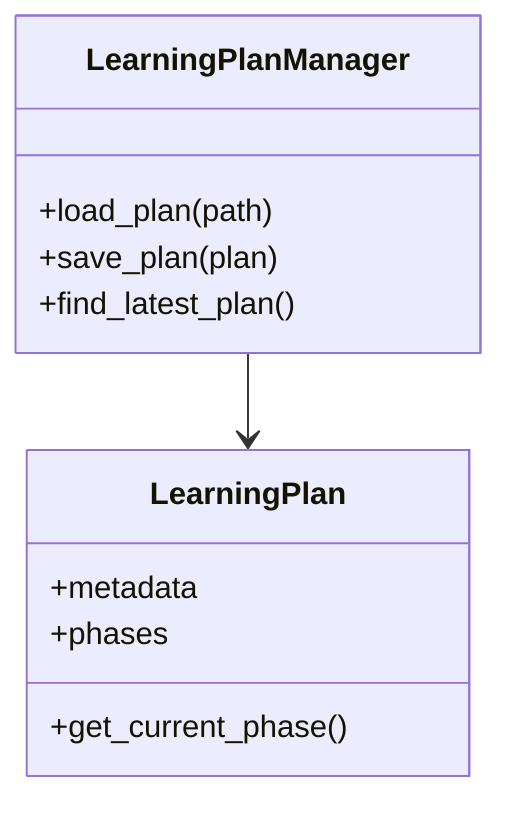

**Use Cases**:
- Teaching object-oriented design
- Showing architecture patterns
- Understanding class hierarchies

---

### 2. Dependency Graph

**Purpose**: Visualize file/module dependencies

**Mermaid Syntax**:
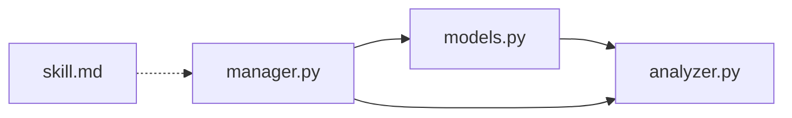

**Use Cases**:
- Understanding codebase structure
- Identifying circular dependencies
- Planning refactoring

---

### 3. Progress Chart

**Purpose**: Show learning progress visually

**Mermaid Syntax**:
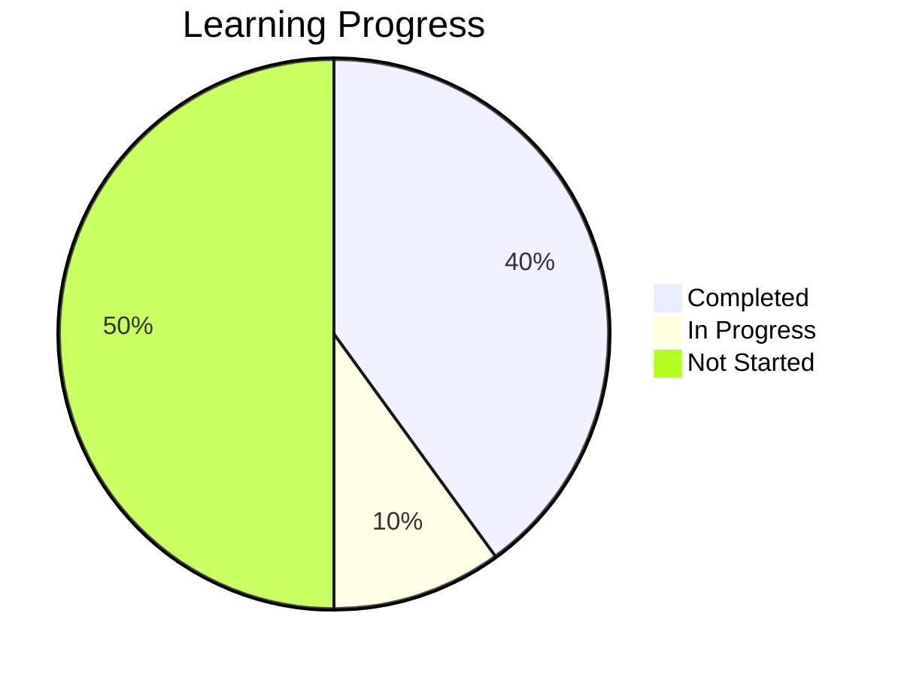

**Use Cases**:
- Quick progress overview
- Motivating visual feedback
- Dashboard displays

---

### 4. Learning Journey

**Purpose**: Visualize entire learning path

**Mermaid Syntax**:
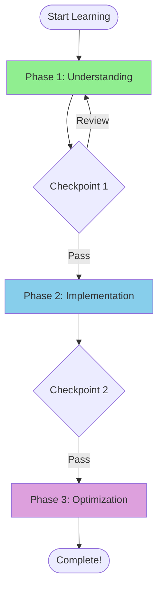

**Use Cases**:
- Showing student where they are
- Visualizing next steps
- Understanding overall plan

---

### 5. Gantt Chart

**Purpose**: Timeline view of learning plan

**Mermaid Syntax**:
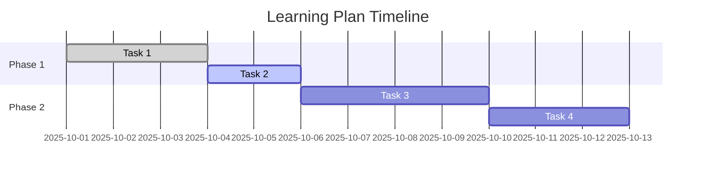

**Use Cases**:
- Time management
- Deadline visualization
- Schedule planning

---

### 6. Velocity Trend (Custom)

**Purpose**: Show learning speed over time

**Mermaid Syntax**:
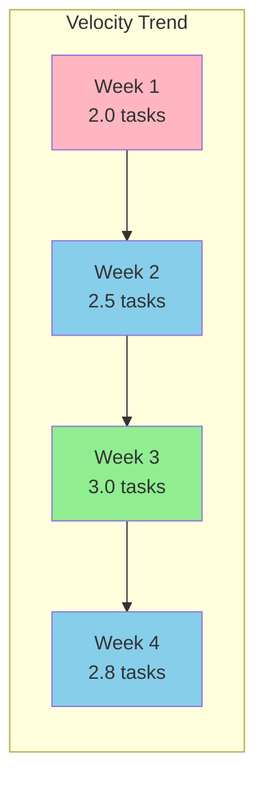

**Use Cases**:
- Tracking improvement
- Identifying slowdowns
- Motivating progress

---

## Implementation Approach

### Phase A: Core Infrastructure (1 hour)

**Implement**:
- DiagramType, DiagramStyle models
- Diagram, DiagramCollection models
- DiagramGenerator base class
- Mermaid code builder utilities

**Files**:
```
skills/interactive_diagram/
├── __init__.py
├── models.py
└── generator.py
```

### Phase B: Code Structure Diagrams (1.5 hours)

**Implement**:
- Class diagram generation from code-analysis
- Dependency graph generation
- Call flow diagram (simplified)

**Integration**: Works with code-analysis skill

### Phase C: Learning Progress Diagrams (1 hour)

**Implement**:
- Progress chart generation
- Learning journey flowchart
- Velocity trend chart

**Integration**: Works with learning-analytics skill

### Phase D: Documentation & Testing (1.5 hours)

**Implement**:
- skill.md for agent integration
- README.md user documentation
- Comprehensive tests
- Example diagrams

---

## Testing Strategy

### Unit Tests

**File**: `examples/test_interactive_diagram.py`

**Tests** (8-10 tests):
1. Test class diagram generation
2. Test dependency graph generation
3. Test progress chart generation
4. Test learning journey generation
5. Test Gantt chart generation
6. Test Mermaid syntax validity
7. Test markdown export
8. Test HTML export
9. Test diagram collection
10. Test style customization

### Visual Tests

Create example diagrams to verify visual quality:
- Example class diagram
- Example progress chart
- Example learning journey

### Integration Tests

Test with real data:
- Generate diagram from actual code-analysis
- Generate diagram from actual learning-analytics
- Export to markdown file and verify rendering

---

## Integration with Agents

### code-architecture-mentor

**Use diagrams to teach architecture:**

```markdown
Skill(interactive-diagram) with query:
"Generate class diagram for skills/learning_plan_manager/"

Agent response:
"Let me show you the architecture of the learning-plan-manager:

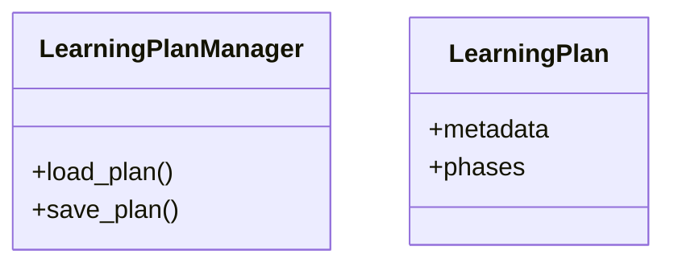

See how LearningPlanManager manages LearningPlan objects?
This is the Manager pattern - a central class that handles
operations on a data model."
```

---

### learning-coordinator

**Visualize progress:**

```markdown
Skill(interactive-diagram) with query:
"Generate progress chart from current analytics"

Agent response:
"Great work! Here's your progress so far:

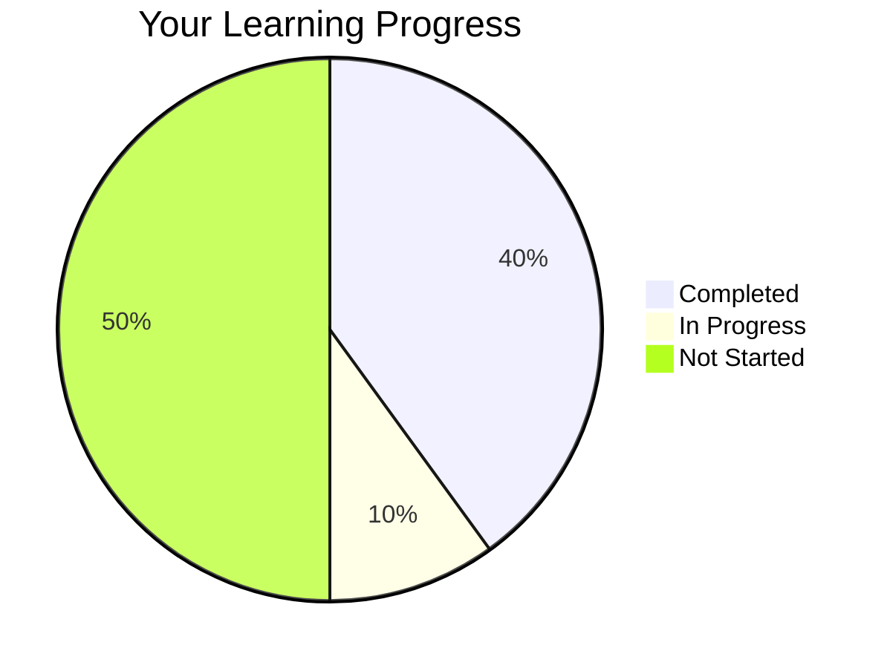

You've completed 40% of tasks! Keep up the momentum!"
```

---

### debugging-detective

**Show dependencies:**

```markdown
Skill(interactive-diagram) with query:
"Generate dependency graph for src/"

Agent response:
"Let's look at how your files depend on each other:

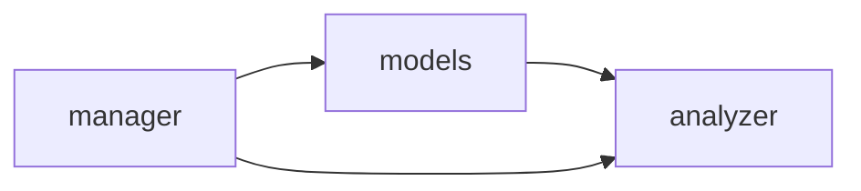

I see manager.py depends on both models and analyzer.
If you're changing the analyzer, you'll need to check manager too."
```

---

## Performance Considerations

### Generation Time

- **Simple diagrams** (5-10 nodes): < 50ms
- **Medium diagrams** (10-50 nodes): < 200ms
- **Complex diagrams** (50+ nodes): < 500ms

### Memory Usage

- Diagram object: ~5-10KB
- Collection of 10 diagrams: ~50-100KB
- Very lightweight (text-based)

### Mermaid Rendering

- **Client-side**: No server load
- **Caching**: Diagrams can be cached as text
- **Scalability**: Excellent (just text generation)

---

## Mermaid Syntax Reference

### Flowchart

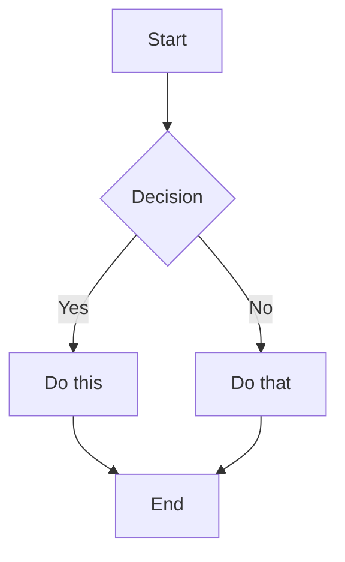

### Class Diagram

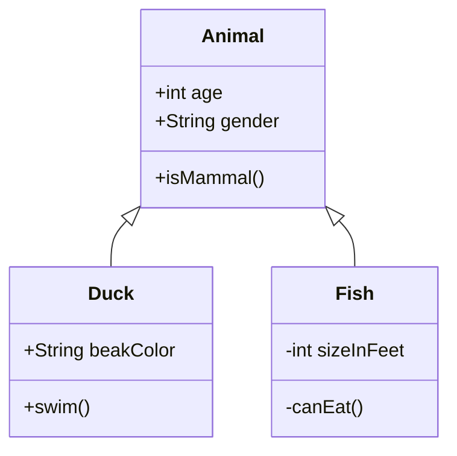

### Gantt Chart

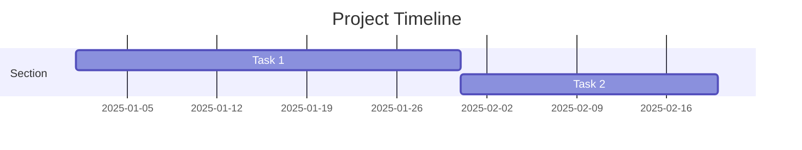

### Pie Chart

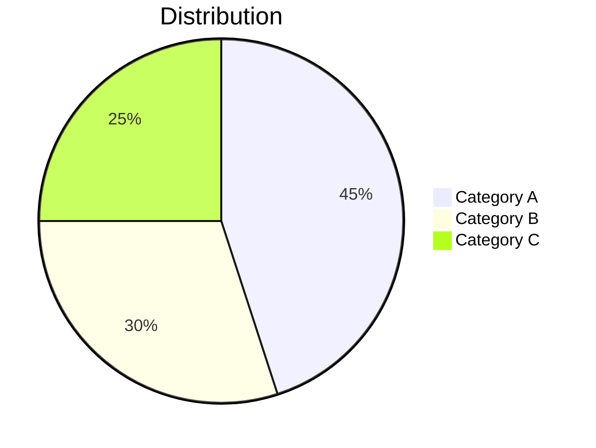

### Graph

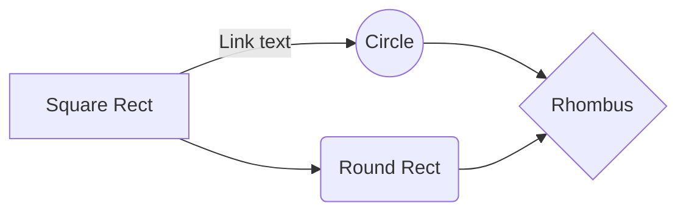

---

## Output Examples

### Example 1: Learning Progress

```python
generator = DiagramGenerator()
analytics = analyzer.analyze_plan(plan)

diagram = generator.generate_progress_chart(analytics)

print(diagram.to_markdown())
```

**Output**:
```markdown
## Learning Progress

Your current progress through the learning plan.

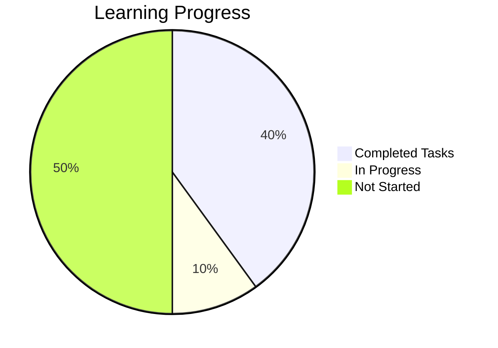
```

---

### Example 2: Class Architecture

```python
generator = DiagramGenerator()
code_analysis = analyzer.analyze_codebase("skills/learning_plan_manager/")

diagram = generator.generate_class_diagram(code_analysis)

print(diagram.to_markdown())
```

**Output**:
```markdown
## Learning Plan Manager Architecture

Class diagram showing main components.

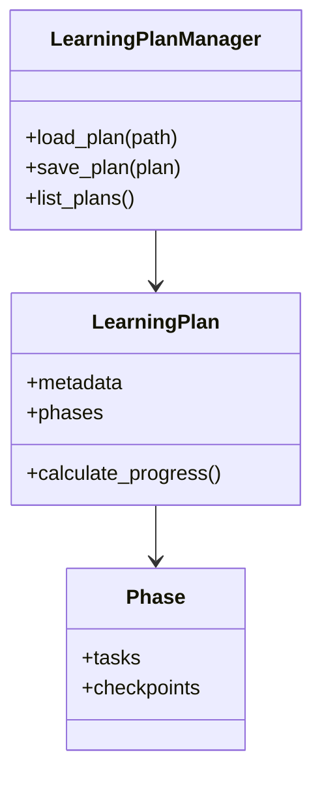
```

---

## Summary

The interactive-diagram skill provides:

✅ **Visual Learning Aids** for better comprehension
✅ **Multiple Diagram Types** for different use cases
✅ **Mermaid-based** - industry standard, widely supported
✅ **No Dependencies** - pure text generation
✅ **Data Integration** - uses code-analysis and learning-analytics
✅ **Agent-Friendly** - easy to invoke and customize

**Complexity**: Medium - text generation with structured data

**Value**: High - visual learning significantly improves comprehension and engagement

---

*Technical Specification End*
