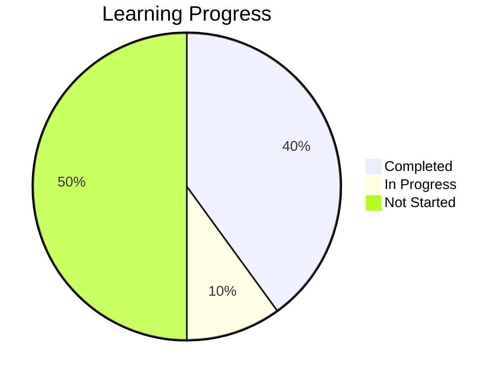
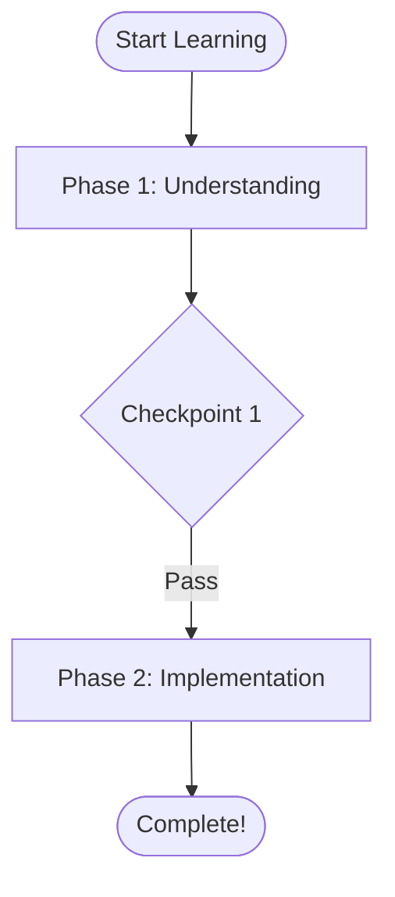

# interactive-diagram Skill

**Version**: 1.0.0
**Status**: Production Ready
**Dependencies**: code-analysis (Phase 1), learning-analytics (Phase 2), learning-plan-manager (Phase 1)

---

## Overview

The `interactive-diagram` skill generates visual learning aids using Mermaid diagram syntax. It transforms data from code-analysis and learning-analytics into visual representations that enhance comprehension and engagement.

### What It Does

- **Generates** Mermaid diagrams from skill data
- **Visualizes** code architecture, progress, learning journeys
- **Creates** class diagrams, flowcharts, pie charts, Gantt charts
- **Enhances** learning through visual representation
- **Exports** to markdown and HTML formats

### Why Visual Learning?

Visual representations improve:
- **Comprehension**: See patterns and structures
- **Retention**: Visuals stick in memory
- **Engagement**: Interactive, appealing content
- **Motivation**: Track progress visually

---

## Features

### Diagram Types (10 types)

**Code Structure** (3 types):
1. **Class Diagrams** - Show code architecture
2. **Dependency Graphs** - Visualize file dependencies
3. **Call Flow** - Show function call chains

**Learning Progress** (3 types):
4. **Progress Charts** - Pie charts of task completion
5. **Learning Journey** - Flowchart of learning path
6. **Velocity Trends** - Learning pace visualization

**Planning** (2 types):
7. **Gantt Charts** - Timeline views
8. **Milestone Maps** - Key checkpoints

**General** (2 types):
9. **Flowcharts** - Custom process flows
10. **Concept Maps** - Concept relationships

---

## Quick Start

```python
from skills.interactive_diagram import DiagramGenerator
from skills.learning_plan_manager import LearningPlanManager
from skills.learning_analytics import LearningAnalyzer

# Initialize
generator = DiagramGenerator()
manager = LearningPlanManager()
analyzer = LearningAnalyzer()

# Load data
plan = manager.find_latest_plan()
analytics = analyzer.analyze_plan(plan)

# Generate diagrams
progress_chart = generator.generate_progress_chart(analytics)
learning_journey = generator.generate_learning_journey(plan, analytics)
gantt_chart = generator.generate_gantt_chart(plan)

# Export to markdown
print(progress_chart.to_markdown())
print(learning_journey.to_markdown())

# Save to file
progress_chart.save_markdown("progress.md")
```

---

## API Reference

### DiagramGenerator

```python
class DiagramGenerator:
    # Code structure diagrams
    def generate_class_diagram(code_analysis, focus_files=None, max_classes=10) -> Diagram
    def generate_dependency_graph(code_analysis, max_files=15) -> Diagram

    # Learning progress diagrams
    def generate_progress_chart(analytics) -> Diagram
    def generate_learning_journey(plan, analytics=None) -> Diagram
    def generate_velocity_trend(analytics, show_weeks=4) -> Diagram

    # Planning diagrams
    def generate_gantt_chart(plan, analytics=None) -> Diagram
    def generate_milestone_map(plan) -> Diagram

    # General diagrams
    def generate_flowchart(steps, title, description) -> Diagram
    def generate_concept_map(concepts, relationships, title) -> Diagram

    # Collections
    def generate_complete_progress_report(plan, analytics) -> DiagramCollection
```

### Diagram Model

```python
class Diagram(BaseModel):
    diagram_type: DiagramType
    title: str
    description: Optional[str]
    mermaid_code: str
    style: DiagramStyle
    metadata: Dict[str, Any]

    def to_markdown() -> str
    def to_html() -> str
    def save_markdown(filepath: str)
```

---

## Usage Examples

### Example 1: Show Learning Progress

```python
generator = DiagramGenerator()
analytics = analyzer.analyze_plan(plan)

# Generate progress chart
diagram = generator.generate_progress_chart(analytics)

# View markdown
print(diagram.to_markdown())
```

**Output**:
```markdown
## Your Learning Progress

8 tasks completed out of 20


```

### Example 2: Visualize Learning Journey

```python
# Generate learning journey with phases and checkpoints
journey = generator.generate_learning_journey(plan, analytics)

print(journey.to_markdown())
```

**Output**:
```markdown
## Your Learning Journey


```

### Example 3: Create Timeline

```python
# Generate Gantt chart
timeline = generator.generate_gantt_chart(plan)

print(timeline.to_markdown())
```

---

## Rendering Mermaid Diagrams

Mermaid diagrams render automatically in:

- ✅ GitHub (markdown files, PRs, issues, wikis)
- ✅ GitLab (markdown files)
- ✅ VS Code (with Mermaid extension)
- ✅ Notion (mermaid blocks)
- ✅ Claude (in AI responses)
- ✅ Many markdown editors

**Just paste the markdown** - rendering happens client-side!

---

## Integration with Other Skills

### With code-analysis

```python
from skills.code_analysis import CodeAnalyzer

analyzer = CodeAnalyzer()
code_analysis = analyzer.analyze_codebase("skills/")

# Generate architecture diagram
diagram = generator.generate_class_diagram(code_analysis)
```

### With learning-analytics

```python
from skills.learning_analytics import LearningAnalyzer

analyzer = LearningAnalyzer()
analytics = analyzer.analyze_plan(plan)

# Generate progress chart
diagram = generator.generate_progress_chart(analytics)
```

### With learning-plan-manager

```python
from skills.learning_plan_manager import LearningPlanManager

manager = LearningPlanManager()
plan = manager.find_latest_plan()

# Generate learning journey
diagram = generator.generate_learning_journey(plan)
```

---

## Performance

- **Generation Time**: < 100ms for most diagrams
- **Memory Usage**: < 10MB (text-based)
- **Output Size**: Typically 200-1000 characters
- **Rendering**: Client-side (no server load)

---

## Styling

Customize diagram appearance:

```python
from skills.interactive_diagram import DiagramStyle

style = DiagramStyle(
    theme="dark",
    orientation="LR",
    show_legend=True,
    color_scheme={
        "completed": "#90EE90",
        "in_progress": "#87CEEB",
        "not_started": "#D3D3D3"
    }
)

diagram = Diagram(
    diagram_type=DiagramType.PROGRESS_CHART,
    title="Custom Progress",
    mermaid_code="...",
    style=style
)
```

---

## Limitations

- **Text-based**: Generates Mermaid syntax, not images
- **Client rendering**: Requires Mermaid-capable renderer
- **Complexity**: Very large diagrams (100+ nodes) may be hard to read
- **Customization**: Limited by Mermaid's capabilities

---

## Dependencies

- ✅ code-analysis skill (optional, for code diagrams)
- ✅ learning-analytics skill (optional, for progress diagrams)
- ✅ learning-plan-manager skill (required, for plan diagrams)
- ✅ Python standard library only
- ✅ Pydantic (already in use)

**No new dependencies!**

---

## License

Part of the Claude Code learning agent system.

---

## Version History

**1.0.0** (2025-10-19)
- Initial release
- 10 diagram types
- Mermaid-based generation
- Integration with Phase 1 & 2 skills

---

*Visual learning makes concepts concrete.*
